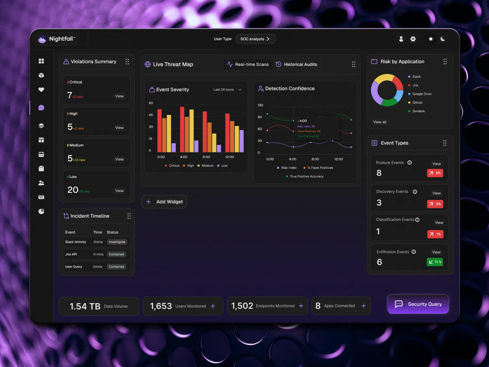
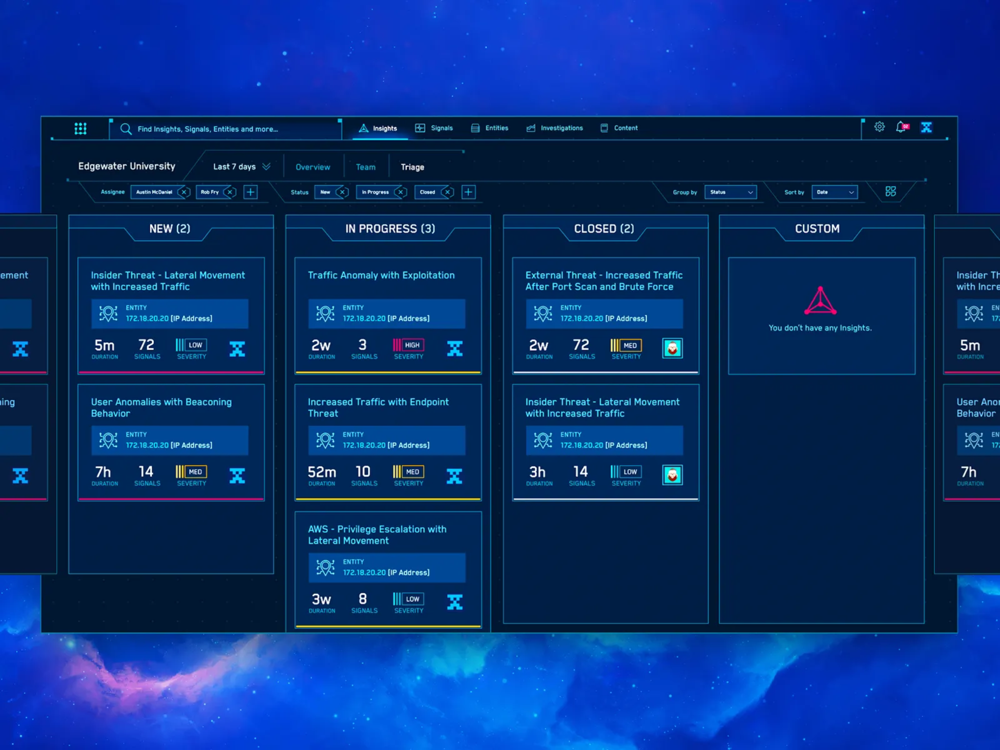
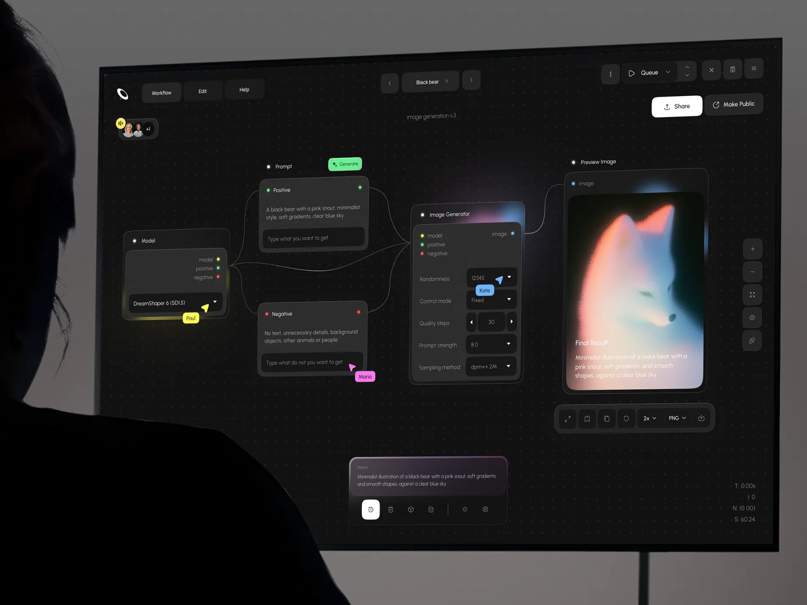

# TelecomSOC-X — Real-Time Telecom SOC (Mini Airtel SIEM + Auto Response)

> A telecom security platform that simulates how SOC and NOC teams detect, triage, and respond to attacks in real time.


---

## 🚀 Why this project stands out

This project is built to look and feel like a **real telecom SOC workflow**:

- Real-time log processing from Linux-style security events
- Detection for brute force, port scanning, sensitive file access, and anomalies
- Auto-response logic that simulates `iptables` blocking
- FastAPI backend for alerts, incidents, and response actions
- Streamlit dashboard for analyst visibility
- Demo attack scripts so the system can be shown live in minutes

**Resume bullet:**

> Built a real-time Telecom SOC system with automated threat detection, AI-style threat explanation, and auto-response using Python, FastAPI, and Streamlit, processing live Linux and network-style logs.

---

## 🧠 Architecture

```text
[Linux / Telecom Logs]
          ↓
[Log File / Filebeat-ready Input]
          ↓
[Detection Engine]
          ↓
[AI-style Explanation Layer]
          ↓
[Response Engine / IP Blocking Registry]
          ↓
[FastAPI Backend]
          ↓
[Streamlit SOC Dashboard]
```

---

## 📁 Project structure

```text
telecom-soc-x/
├── backend/
│   └── app/
│       ├── main.py
│       ├── config.py
│       ├── models.py
│       ├── store.py
│       ├── routes/
│       └── services/
├── dashboard/
│   └── app.py
├── detection_engine/
│   └── engine.py
├── response_engine/
│   └── firewall.py
├── simulator/
│   └── generate_logs.py
├── attacks/
│   ├── bruteforce_sim.py
│   ├── port_scan_sim.py
│   └── sensitive_access_sim.py
├── scripts/
│   ├── run_demo.sh
│   └── reset_state.py
├── configs/
│   └── filebeat.example.yml
├── data/
│   ├── logs/
│   └── state/
├── assets/
│   └── screenshots/
├── docker-compose.yml
├── Dockerfile
├── requirements.txt
└── README.md
```

---

## ⚙️ Features

### Detection
- SSH brute force detection
- Port scan detection
- Sensitive file access detection
- Simple anomaly detection hooks

### Response
- Auto-block registry for malicious IPs
- Live/manual block API endpoint
- Containment-oriented incident status flow

### Analyst experience
- Severity distribution
- Top attacking IPs
- Incident board table
- Alert and block registry views

---

## 🖥️ API endpoints

| Method | Endpoint | Purpose |
|---|---|---|
| GET | `/` | health check |
| POST | `/scan` | process new logs and generate detections |
| GET | `/alerts` | list alerts |
| GET | `/incidents` | list incidents |
| GET | `/blocked` | list blocked IPs |
| POST | `/block/{ip}` | manual block |
| GET | `/summary` | dashboard summary |
| POST | `/incident/{incident_id}/status/{status}` | update incident status |

---

## 🛠️ Local setup

### 1) Clone and enter the repo

```bash
git clone https://github.com/HR10J44T/telecom-soc-x
cd telecom-soc-x
```

### 2) Create virtual environment

```bash
python -m venv .venv
source .venv/bin/activate
# Windows:
# .venv\Scripts\activate
```

### 3) Install dependencies

```bash
pip install -r requirements.txt
```

### 4) Start the API

```bash
uvicorn backend.app.main:app --reload --port 8000
```

### 5) Start the dashboard in another terminal

```bash
streamlit run dashboard/app.py
```

### 6) Generate demo data

```bash
python simulator/generate_logs.py
python attacks/bruteforce_sim.py
python attacks/port_scan_sim.py
python attacks/sensitive_access_sim.py
curl -X POST http://127.0.0.1:8000/scan
```

### 7) Open the UI

- API docs: `http://127.0.0.1:8000/docs`
- Dashboard: `http://127.0.0.1:8501`

---

## 🐳 Docker setup

```bash
docker compose up --build
```

Then open:

- API: `http://127.0.0.1:8000/docs`
- Dashboard: `http://127.0.0.1:8501`

---

## ⚔️ Demo attack scripts

### Brute force simulation
```bash
python attacks/bruteforce_sim.py
```
Creates repeated failed login events from a single attacker IP.

### Port scan simulation
```bash
python attacks/port_scan_sim.py
```
Creates a single reconnaissance event with many probed ports.

### Sensitive file access simulation
```bash
python attacks/sensitive_access_sim.py
```
Creates a high-severity protected-file access event.

### Full demo run
```bash
bash scripts/run_demo.sh
```

---

## 📸 Screenshots section

Add your own dashboard screenshots after you run the project. For now, the UI inspiration references are included below.

### UI inspiration references

| SOC Dashboard | Incident Board | AI Workflow Panel |
|---|---|---|
|  |  |  |

### Recommended screenshots to add after running

- `assets/screenshots/dashboard-live.png`
- `assets/screenshots/incidents-table.png`
- `assets/screenshots/blocked-ips.png`
- `assets/screenshots/api-docs.png`

Then place them in a section like this:

---

## 🧪 Work-Flow

1. Start API and dashboard
2. Run brute-force and port-scan scripts
3. Trigger `/scan`
4. Open dashboard and show:
   - Critical and high severity alerts
   - Incident rows generated automatically
   - Blocked IP registry
5. Explain how the same design can be extended with ELK, Kafka, and live Linux log ingestion

---

## 🔒 Notes on live blocking

This repository **simulates** firewall response by default and stores blocked IPs in `data/state/blocked_ips.json`.

If you later want to run real `iptables` commands on a Linux lab machine, add guarded logic and use a sandbox VM. Do not test live blocking on a production host.

---

## 📈 Suggested future upgrades

- Replace file-based state with PostgreSQL + Redis
- Add Kafka for high-volume streaming
- Add Filebeat / Logstash / Elasticsearch integration
- Add role-based authentication
- Build the Next.js SOC dashboard from the design PRD
- Add MITRE ATT&CK mapping and threat intel enrichment

---

## 🏆 Why this gets attention

This does not look like a generic student CRUD project.
It demonstrates:

- Linux security understanding
- Detection engineering mindset
- SOC/NOC workflow awareness
- API + dashboard integration
- Security automation thinking

That combination is exactly what makes a fresher look stronger for **telecom security, SOC, NOC, and cyber defense roles**.
